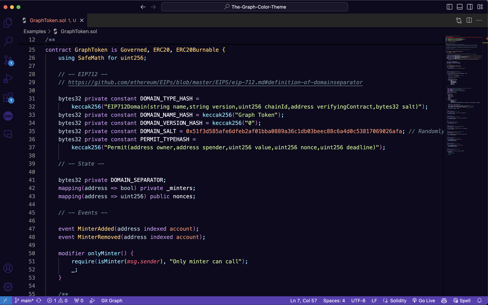
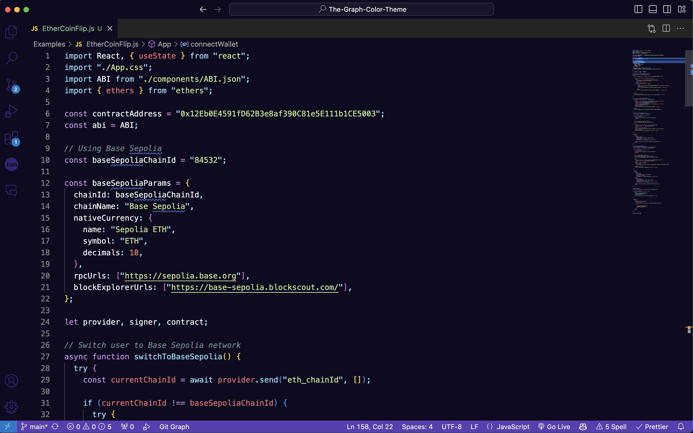

# The Graph Color Theme 🟣

This color theme is inspired by the colors of The Graph Network, a decentralized protocol for indexing and querying blockchain data.

## The Graph Color Theme

Learn [more about The Graph](https://thegraph.com/) or [help improve this theme by submitting an issue](https://github.com/MichaelMacaulay/The-Graph-Color-Theme/issues).
